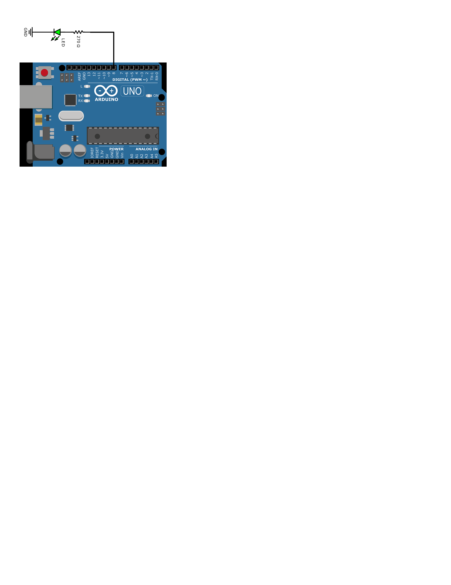

# Lab 1: Minh Hieu Tran
### Morse code

1. Listing of C code which repeats one "dot" and one "comma" (BTW, in Morse code it is letter `A`) on a LED. Always use syntax highlighting, meaningful comments, and follow C guidelines:

```c
int main(void)
{ 
    pinMode(LED_GREEN, OUTPUT);
    digitalWrite(LED_RED, LOW);

    // Set pin where on-board LED is connected as output
    

    // Infinite loop
    while (1)
    {
      digitalWrite(LED_RED, HIGH);
      _delay_ms(DOT);
      digitalWrite(LED_RED, LOW);
      _delay_ms(DOT);
      digitalWrite(LED_RED, HIGH);
      _delay_ms(DASH);
      digitalWrite(LED_RED, LOW);
      _delay_ms(SPACE);
    }

    // Will never reach this
    return 0;
}
```

2. Scheme of Morse code application, i.e. connection of AVR device, LED, resistor, and supply voltage. The image can be drawn on a computer or by hand. Always name all components and their values!

   
