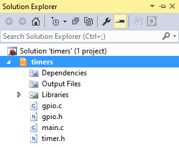
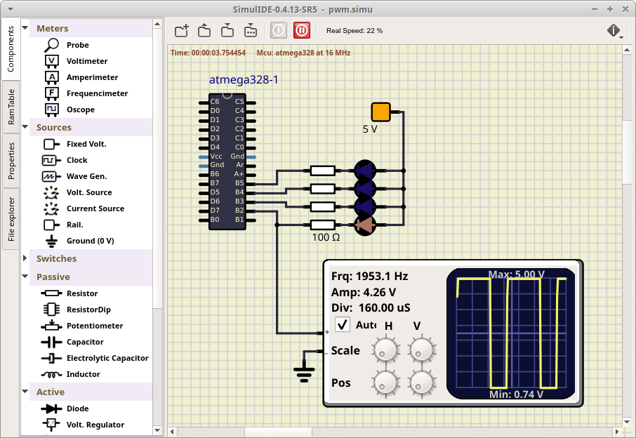

2. Shields are boards that can be attached to an Arduino board, significantly expand its capabilities, and makes prototyping much faster. See schematic of [Multi-function shield](https://oshwlab.com/tomas.fryza/arduino-shields) and find out the connection of four LEDs (D1, D2, D3, D4) and three push buttons (S1-A1, S2-A2, S3-A3).

&nbsp;

&nbsp;

&nbsp;

&nbsp;

&nbsp;

&nbsp;


### Version: Atmel Studio 7

1. Create a new GCC C Executable Project for ATmega328P within `04-interrupts` working folder and copy/paste [template code](main.c) to your `main.c` source file.

2. In **Solution Explorer** click on the project name, then in menu **Project**, select **Add New Item... Ctrl+Shift+A** and add a new C/C++ Include File `timer.h`. Copy/paste the [template code](../library/include/timer.h) into it.

3. In **Solution Explorer** click on the project name, then in menu **Project**, select **Add Existing Item... Shift+Alt+A** twice and add both GPIO library files (`gpio.h`, `gpio.c`) from the previous lab.

   

### Version: Command-line toolchain

1. Check if `library` folder and `Makefile.in` settings file exist within `Labs` folder. If not, copy them from the `Examples` folder.

2. Copy `main.c` and `Makefile` files from previous lab to `labs/04-interrupts` folder.

3. Copy/paste [template code](main.c) to your `04-interrupts/main.c` source file.

4. Create a new library header file in `labs/library/include/timer.h` and copy/paste the [template code](../library/include/timer.h) into it.


<a name="part5"></a>

## Part 5: PWM (Pulse Width Modulation)

Pulse Width Modulation or PWM is a common technique used to vary the width of the pulses in a pulse-train. PWM has many applications such as controlling servos and speed controllers, limiting the effective power of motors and LEDs [[8]](https://www.tutorialspoint.com/arduino/arduino_pulse_width_modulation.htm). There are various terms associated with PWM:

* On-Time: duration of time signal is high,
* Off-Time: duration of time signal is low,
* Period: the sum of on-time and off-time of PWM signal,
* Duty Cycle: the percentage of time signal that remains on during the period of the PWM signal.


Use schematic of [Arduino Uno](https://oshwlab.com/tomas.fryza/arduino-shields) board or [ATmega328P datasheet](https://www.microchip.com/wwwproducts/en/ATmega328p) and in the following table write which Arduino Uno pins can be used to generate the PWM signal by internal timer modules.

| **Module** | **Description** | **MCU pin** | **Arduino pin** |
| :-: | :-: | :-: | :-: |
| Timer/Counter0 | OC0A |     |    |
|                | OC0B |     |    |
| Timer/Counter1 | OC1A |     |    |
|                | OC1B | PB2 | 10 |
| Timer/Counter2 | OC2A |     |    |
|                | OC2B |     |    |


1. Use the [ATmega328P datasheet](https://www.microchip.com/wwwproducts/en/ATmega328p) (section **16-bit Timer/Counter1 with PWM > Register Description**) and configure Timer/Counter1 to generate a PWM (Pulse Width Modulation) signal on channel B (pin PB2, OC1B). Configure Timer/Counter1 as follows:
   * Select Compare output mode, Fast PWM in register TCCR1A: **non-inverting mode** (Clear OC1A/OC1B on Compare Match, set OC1A/OC1B at BOTTOM),
   * Select Waveform generation in registers TCCR1A and TCCR1B: **Fast PWM, 10-bit**,
   * Select clock prescaler in TCCR1B: **8**,
   * Set default duty cycle in OCR1B to 50%: **0x01FF**,
   * Enable Output Compare B Match Interrupt in TIMSK1: **OCIE1B**.

   Do not forget to enable interrupts by setting the global interrupt mask `sei()` and increment the duty cycle in OCR1B when the timer value is equal to compare value, ie. within interrupt handler `ISR(TIMER1_COMPB_vect)`. Clear the OCR1B value when it reaches its maximum, ie 0x03FF.

   Note that, the 16-bit value of the output compare register pair OCR1BH:L is directly accessible using the OCR1B variable defined in the AVR Libc library.

   Connect an oscilloscope to PB2 pin (in SimulIDE **Meters > Oscope**) and observe the changes in the generated signal.

   


4. Extend the existing application and control four LEDs in [Knight Rider style](https://www.youtube.com/watch?v=w-P-2LdS6zk). Do not use delay library, but a single Timer/Counter.

   FYI: Use static variables declared in functions that use them for even better isolation or use volatile for all variables used in both Interrupt routines and main code loop. For example in code [[7]](https://stackoverflow.com/questions/52996693/static-variables-inside-interrupts) the line `static uint16_t i=0;` will only run the first time.

```c
void IRQHandler()
{
    static uint16_t i=0;  // This line only run the first time

    if (i>=500)
    {
        i=0;  // Variable is reset when function IRQHandler is executed 500 times
    }
    else
    {
        i++;  // Static variable is incremented any time function IRQHandler is executed
    }
}
```


Consider a push button in the application. If the push button is pressed, let the LEDs blink faster; when the push button is released, the blinking is slower. Note: Do not use an interrupt to check the status of a push button, but a read function from your GPIO library.


2. (Optional) Consider an active-low push button with internal pull-up resistor on the PD2 pin. See the [ATmega328P datasheet](https://www.microchip.com/wwwproducts/en/ATmega328p) (section **External Interrupts**) and config INT0. When push button is pressed, the Timer0 prescaler setting is changed.


*Prepare all parts of the assignment in Czech, Slovak or English according to this [template](assignment.md), export formatted output (not Markdown) [from HTML to PDF](https://github.com/tomas-fryza/digital-electronics-2/wiki/Export-README-to-PDF), and submit a single PDF file via [BUT e-learning](https://moodle.vutbr.cz/). The deadline for submitting the task is the day before the next laboratory exercise.*

> *Vypracujte všechny části úkolu v českém, slovenském, nebo anglickém jazyce podle této [šablony](assignment.md), exportujte formátovaný výstup (nikoli výpis v jazyce Markdown) [z HTML do PDF](https://github.com/tomas-fryza/digital-electronics-2/wiki/Export-README-to-PDF) a odevzdejte jeden PDF soubor prostřednictvím [e-learningu VUT](https://moodle.vutbr.cz/). Termín odevzdání úkolu je den před dalším počítačovým cvičením.*
>


